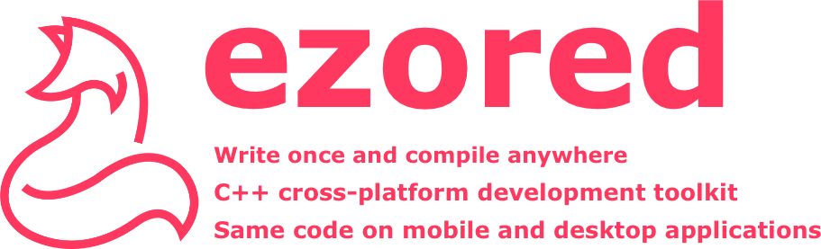
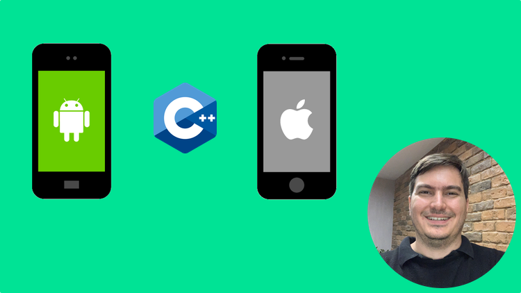

# Ezored

## About - English

THIS REPOSITORY IS OLD AND EXISTS ONLY BECAUSE OF THE UDEMY COURSE I TAKEN, BECAUSE I DON'T WANT THE STUDENTS TO HAVE DIFFICULTIES IN TAKING THE COURSE:

https://www.udemy.com/course/desenvolvendo-aplicativos-mobile-com-cpp-para-android-e-ios/

TO ACCESS THE MOST STABLE AND CURRENT VERSION, ACCESS HERE:

https://github.com/ezored/ezored

## About - Português

ESTE REPOSITÓRIO É ANTIGO E EXISTE SOMENTE POR CAUSA DO CURSO DA UDEMY QUE FIZ, POIS NÃO QUERO QUE OS ALUNOS TENHAM DIFICULDADES EM FAZER O CURSO:

https://www.udemy.com/course/desenvolvendo-aplicativos-mobile-com-cpp-para-android-e-ios/

PARA ACESSAR A VERSÃO MAIS ESTÁVEL E ATUAL, ACESSE AQUI:

https://github.com/ezored/ezored

## Buy me a coffee

## Training

Udemy (portuguese): Crie aplicativos Android, iOS e Desktop de alta performance com C++ usando um único código multi-plataforma

https://www.udemy.com/course/desenvolvendo-aplicativos-mobile-com-cpp-para-android-e-ios/

## Supported By Jetbrains IntelliJ IDEA

## License

[MIT](http://opensource.org/licenses/MIT)

Copyright (c) 2019-present, Paulo Coutinho
